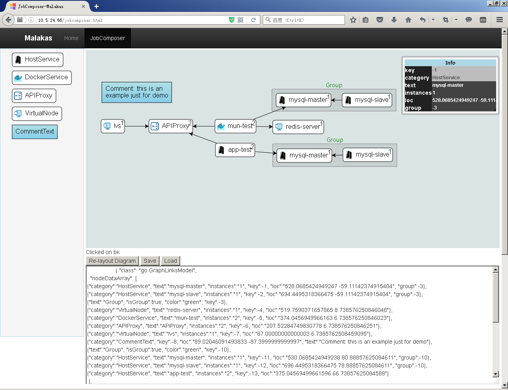
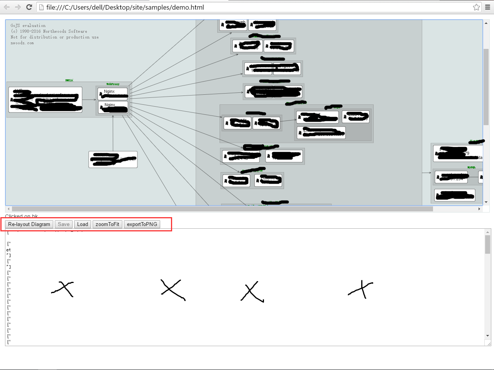

# dag-editor-js
DAG editor based on GoJS, as general task workflow dependency designer。简易DAG图形设计器，使用拖拽方式对应用自动化编排。包括Host、Docker应用等。此项目为私有云平台子项目DEMO。

### Screentshot:
* 图形设计器：
  

* 图形展示：
  

### 参考效果:
* http://demo.qunee.com/#VOIP Demo
* http://gojs.net/latest/samples/stateChart.html
